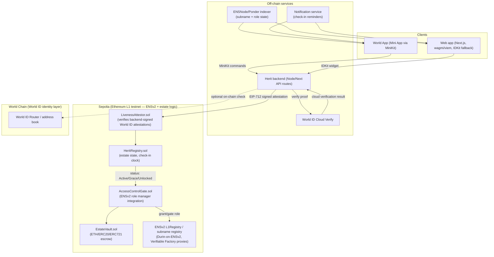

# Herit — Architecture Document

**Next-of-kin inheritance, gated by proof of life**
ETHOnline Hackathon (World track & ENS track)
Version 0.1 (hackathon scope)

---

## 1. Executive Summary

Herit lets an asset holder (or "Grantor") register heirs under their own ENS name as **subnames**, define a **check-in interval**, and prove they are alive through a periodic **Selfie Check**. If the Grantor misses their check-in window, a grace period elapses and then **Enhanced Access Control** rights over the estate are transferred to the heirs' subnames. An heir must themselves pass a Selfie Check, proving they are a unique, live human and the legitimate controller of their subname before they can claim.

Herit is a "dead-man's switch" pattern, but the two things that are normally weak in that pattern — *who counts as the account owner* and *who counts as the rightful heir* — are hardened with World ID's proof-of-personhood, and the *identity and authority structure of the heir* is expressed natively as an ENS name rather than an opaque address, using ENSv2's new hierarchical registries and role-based permission system.

---

## 2. Why This Is a Real Problem (and why existing tools don't solve it)

Every "crypto inheritance" idea eventually collides with two unsolved problems:

1. Proof of life is usually last transaction timestamp: Dead-man's-switch contracts (e.g. simple `lastActive` timestamps refreshed by any tx) are trivially gamed by bots, delegated signers, or a compromised key — a hacked wallet can "prove" the owner is alive by pinging the contract.
2. Heirs are usually just addresses: An address has no verifiable link to a real, unique human, and no legible identity for the Grantor to reason about while setting things up.

Herit's two core bets directly answer these:

| Problem | Herit's answer | Why it's the right tool |
|---|---|---|
| Fake "proof of life" from a bot/compromised key | World ID **Selfie Check** (liveness + uniqueness proof) required to check in | A stolen private key cannot pass a biometric liveness+personhood check |
| Illegible, unverifiable heirs | Heirs registered as **ENS subnames** under the Grantor's own name | A subname (`daughter.alice.eth`) is human-readable, portable across wallets, and can hold **roles**, not just be a resolution target, which is what ENSv2 needs for "enhanced access control" to be a real on-chain concept rather than a marketing phrase |

---

## 3. Track Fit

### 3.1 World track
- Selfie Check = World ID verification, used twice, for two different purposes:
  1. Grantor liveness loop: a recurring proof-of-personhood + liveness check that gates whether the estate stays locked.
  2. Heir claim gate: a one-time proof-of-personhood check that gates whether a claim is honored, preventing a single human from registering many "heir" identities to siphon an estate, and preventing a bad actor from claiming on behalf of a deceased/incapacitated heir.

### 3.2 ENS track
- Heirs are not just given a role at an address; they are given an ENS subname, using **ENSv2** (currently in public beta exclusively on Sepolia).
---

## 4. Core Concepts & Terminology

| Term | Definition |
|---|---|
| **Grantor** | The asset holder who owns `alice.eth` (or similar) and sets up an estate. |
| **Estate** | The Herit record tied to one Grantor's ENS name: heir list, check-in interval, grace period, vault, status. |
| **Heir** | A next-of-kin, registered either as an **ENS subname** under the Grantor's name (`son.alice.eth`) or as a raw address (fallback for heirs who don't want/need an ENS identity). |
| **Selfie Check** | A World ID verification action (liveness + uniqueness proof via Orb or supported device verification) scoped to a specific Herit action (`checkin-alice-eth`, `claim-son-alice-eth`, etc.) via World ID's action/nonce mechanism, so proofs can't be replayed across estates or across Grantor/heir roles. |
| **Check-in interval** | Grantor-defined duration (e.g., 30 days) within which a fresh Selfie Check must land or the estate enters Grace. |
| **Grace period** | A secondary, shorter window after a missed check-in during which the Grantor can still recover by checking in. a safety margin against travel, illness, or a bad network day, not just true incapacitation. |
| **Enhanced Access Control (EAC)** | The ENSv2 role(s) granted to heir subnames that, once exercisable, permit claiming from the estate vault and/or taking over resolution of the relevant subname. Before unlock, the role exists in the registry but is administratively gated by Herit's contracts. |
| **Unlock** | The state transition, triggered permissionlessly once grace expires, that flips EAC from dormant to exercisable. |

---

## 5. High-Level Architecture

**Why a backend attestor sits between World ID and the contracts, instead of verifying proofs fully on-chain:** 
World ID's on-chain verifier infrastructure is deployed on World Chain (and bridged to a small set of other chains); ENSv2 is currently only deployed on Sepolia. There is no chain today that has both natively. Rather than block the whole project on a cross-chain bridge/oracle build, Herit verifies World ID proofs through the **Cloud Verify API** (the officially supported, non-on-chain verification path) in a backend service, then has the backend sign an **EIP-712 attestation** that a purpose-built `LivenessAttestor` contract on Sepolia checks before forwarding a check-in or claim to `HeritRegistry`. This is a standard, well-understood trust-minimization pattern (attestor/oracle with a narrowly scoped, single-purpose signing key, replay-protected by action+nonce+expiry), and it is explicitly called out as an acceptable World ID integration pattern ("proof validation is required and needs to occur in a **web backend or smart contract**").

---

## 6. Component Breakdown

### 6.1 Frontend
- **Next.js** app, dual-mode: standard web app and **World App Mini App** (MiniKit SDK).
- `wagmi` / `viem` for standard wallet interactions on Sepolia; MiniKit for World App-native auth, verification, and (abstracted-gas) transaction signing.
- `ensjs` to read subname/role state for display (heir dashboards, "your EAC is dormant/exercisable" indicators).
- Reasoning: this dual-mode approach is exactly the shape ETHGlobal's own World Mini App guidance describes, and it means Herit isn't *locked into* World App-only distribution — a Grantor's elderly relative without World App can still be an heir via the web fallback, which matters for a genuinely usable inheritance product.

### 6.2 Smart contracts (Sepolia)

| Contract | Responsibility |
|---|---|
| `HeritRegistry.sol` | Per-estate state machine: `lastCheckIn`, `checkInInterval`, `graceDuration`, `status ∈ {Active, Grace, Unlocked}`, heir list (subname node hashes and/or addresses). Exposes `checkIn()`, `pokeExpiry()` (permissionless status transition), view functions. |
| `LivenessAttestor.sol` | Verifies a backend-signed EIP-712 message `{estateId, subject, action, nonce, expiry}` proving a Selfie Check passed; forwards validated calls to `HeritRegistry`/`ClaimManager`. Nonce + expiry + action-scoping prevents replay across estates and across the Grantor/heir roles. |
| `AccessControlGate.sol` | Bridges `HeritRegistry.status` to ENSv2's role system on the estate's subname registry. While `Active`/`Grace`, holds the "executor"/claim role administratively frozen on heir subnames. On `Unlocked`, grants/unfreezes the role so the corresponding heir can act. |
| `EstateVault.sol` | Minimal escrow: Grantor deposits ETH/ERC20/ERC721 they explicitly want willed through Herit. Kept as an explicit opt-in vault (rather than a Safe module that manages the Grantor's *entire* existing wallet) so the hackathon build has a clean, demoable custody boundary|
| `ClaimManager.sol` | Heir-facing entrypoint: given a valid heir Selfie Check attestation + proof of subname/role ownership + `Unlocked` status, releases the heir's allotted share from `EstateVault` and/or flips the subname's resolver/owner records to the heir's controlling address. |

### 6.3 ENS layer
- One **ENSv2 subname registry per estate**, deployed via the **Verifiable Factory** pattern (deterministic, cheap, no bespoke proxy code to audit).
- Heirs are added as subname nodes (`son.alice.eth`) inside that registry with a role that is present but administratively gated by `AccessControlGate`.
- Heirs who prefer not to hold an ENS identity can instead be registered as a raw address with the same role-gating logic minus the subname — Herit treats "subname" as the richer, recommended path and "address" as the minimum-viable fallback, so the product doesn't force ENS adoption on someone who just wants to protect a wallet quickly.

### 6.4 Off-chain services
- **Herit backend**: orchestrates World ID Cloud Verify calls, issues EIP-712 attestations, exposes REST/RPC endpoints to the frontend.
- **Indexer** (Ponder/ENSNode-style): mirrors on-chain estate + role state for fast reads (dashboards, "days until check-in due" widgets) without hammering the RPC node.
- **Notification service**: reminds Grantors before their window closes (email/push/World App notification) — this is a UX necessity, not a security control; the contract's state machine is the source of truth regardless of whether a reminder fires.

---

## 7. Key Flows

### 7.1 Estate setup
1. Grantor authenticates (World ID via MiniKit/IDKit) and connects the wallet that owns `alice.eth`.
2. Grantor deploys (or reuses) an ENSv2 subname registry for `alice.eth` via the Verifiable Factory.
3. Grantor adds heirs: for each, either mint a subname (`son.alice.eth`) with a dormant EAC role, or register a raw address with the equivalent gated role.
4. Grantor sets `checkInInterval` and `graceDuration` and (optionally) deposits assets into `EstateVault`.
5. Grantor performs an initial Selfie Check to start the clock.

### 7.2 Recurring check-in
1. Before `lastCheckIn + checkInInterval` elapses, Grantor performs a Selfie Check (World ID action = `checkin:{estateId}`).
2. Backend verifies via Cloud Verify, signs an attestation, submits to `LivenessAttestor` → `HeritRegistry.checkIn()`, resetting `lastCheckIn`.
3. If the window is missed, anyone (or an automation like Chainlink Automation / Gelato) can permissionlessly call `pokeExpiry()`, which flips status to `Grace`.

### 7.3 Missed check-in → Unlock
1. If the Grantor performs a valid Selfie Check during `Grace`, status returns to `Active` — this is the built-in "false alarm" recovery path.
2. If `graceDuration` also elapses with no valid check-in, `pokeExpiry()` flips status to `Unlocked`.
3. `AccessControlGate` observes `Unlocked` and unfreezes the EAC role(s) on the relevant heir subname(s)/addresses.

### 7.4 Heir claim
1. Heir authenticates and performs their own Selfie Check, scoped to `claim:{estateId}:{heirNode}`.
2. Backend verifies via Cloud Verify, signs an attestation, submits to `ClaimManager`.
3. `ClaimManager` checks: (a) estate is `Unlocked`, (b) heir's Selfie Check attestation is valid and unused, (c) caller controls the claimed subname/address, then releases the heir's vault allocation and/or finalizes the subname handover.

---

## 8. Security & Trust Considerations

| Risk | Mitigation | Residual risk |
|---|---|---|
| Compromised Grantor key pings check-in without the human being alive | Check-in requires a fresh World ID liveness proof, not just a signed tx | World ID itself trusts the Orb/device verification pipeline; Herit inherits that trust boundary, it doesn't add a new one |
| Sybil heirs (one human registers many heir identities to grab more of an estate) | World ID's uniqueness guarantee scopes one human to one valid claim proof per action-nonce | A determined attacker with access to multiple verified humans (e.g., paid accomplices) is outside what any proof-of-personhood system alone can stop — Herit doesn't claim to solve collusion |
| Backend attestor key compromise | Narrow single-purpose key, EIP-712 domain-separated to Herit only, action+nonce+expiry replay protection, ideally rotated via a small multisig | This is the biggest centralization point in the hackathon build; flagged explicitly in §10 as the top thing to decentralize post-hackathon |
| Premature/accidental unlock (Grantor traveling, no signal) | Two-stage timer (interval + separate grace period), Grantor-visible countdown + reminders | Any fixed-timeout dead-man's switch has this tradeoff; tuning `graceDuration` per estate is a Grantor-facing setting, not hardcoded |
| Heir claims but isn't actually the intended person behind a raw-address heir slot | Raw-address heirs skip the ENS-identity legibility benefit; recommend subname heirs for anything but the smallest estates | Documented as a tradeoff of the fallback path, not hidden |

---

## 9. Hackathon Scope

**In scope (MVP demo path):**
- ENSv2 subname registry deployment for one Grantor estate on Sepolia via Durin's ENSv2 path.
- `HeritRegistry`, `LivenessAttestor`, `AccessControlGate`, `EstateVault`, `ClaimManager`: deployed on Sepolia.
- World ID Selfie Check for both Grantor check-in and heir claim, via MiniKit in a World Mini App shell + IDKit web fallback.
- Manual/short-interval demo timers (minutes, not months) so the check-in → grace → unlock flow can be shown live at the demo table.
- Simple ETH/ERC20 vault deposit and claim.

**Explicitly out of scope:**
- Managing a Grantor's *existing* wallet/assets directly (would require a Safe module or account-abstraction guardian setup.
- On-chain (non-cloud) World ID proof verification bridged to Sepolia.
- Multi-guardian dispute/override committee for contested unlocks.
- Mainnet ENSv2 (it doesn't exist yet. Sepolia is the only place this can be built as of time of writing this document).

---

## 10. Post-Hackathon Roadmap

1. **Safe{Wallet} module integration** — let a Grantor's actual multisig/Smart Account be the estate, with EAC roles becoming Safe module permissions instead of a bespoke vault. This is the real path to "inherit your whole wallet," not just a willed deposit.
2. **On-chain World ID verification once a chain hosts both World ID's verifier and ENSv2 mainnet** — removes the backend attestor as a trust point.
3. **Guardian committee / dispute window** — allow a small set of Grantor-nominated humans (also World ID-verified) to pause an unlock they believe is erroneous, with a time-boxed veto rather than indefinite discretion.
4. **Multi-asset, multi-chain vaults** — beyond Sepolia testnet assets, once ENSv2 is live on mainnet.
5. **Recurring liveness cadence tuned by risk** — e.g., shorter intervals for larger estates, configurable per-heir shares.

---

## 11. Tech Stack Summary

| Layer | Choice | Why |
|---|---|---|
| Frontend | Next.js, wagmi/viem, MiniKit, IDKit, ensjs | Dual World-App/web distribution; standard, well-supported EVM + ENS + World ID libraries |
| Identity | World ID (Orb/device Selfie Check), Cloud Verify API | Proof-of-personhood + liveness, chain-agnostic verification path that unblocks the Sepolia/World Chain mismatch |
| Naming | ENSv2 (Sepolia beta), Durin (ENSv2-Sepolia path), Verifiable Factory | Hierarchical registries + role-based permissions are the literal on-chain primitive "Enhanced Access Control" needs |
| Contracts | Solidity, Sepolia testnet | Matches ENSv2's current deployment; Foundry-based tooling (aligned with Durin) |
| Indexing | Ponder / ENSNode-style indexer | Fast reads of estate + role state without custom subgraph infra |
| Automation | Chainlink Automation / Gelato (or manual demo trigger) | Permissionless `pokeExpiry()` calls so unlock doesn't depend on any single party remembering to poke the contract |

---

## 12. Closing Note

Every non-trivial decision above traces back to one of two constraints that are easy to state and hard to fake: **prove the human is alive**, and **make the heir's authority a legible, on-chain-native identity rather than a bare address**. World ID and ENSv2's role-based subnames are, respectively, close to purpose-built for those two constraints right now, which is why Herit is architected as a genuine integration of both tracks rather than a single feature wearing two badges.