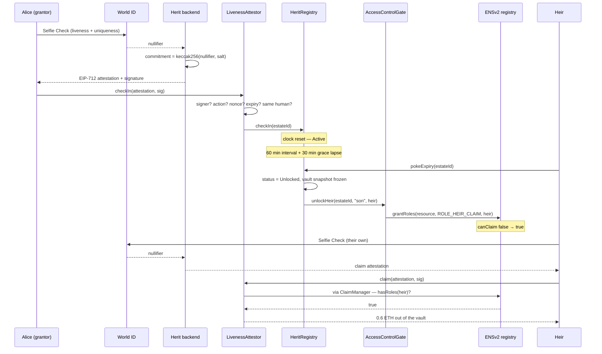

# Herit

> Your heirs hold ENS subnames that cannot claim anything — until you stop proving, with your face, that you are alive.

**ETHOnline 2026** · World track & ENS track · World ID Selfie Check + ENSv2 Enhanced Access Control

[Live app](https://herit-psi.vercel.app/) · [Deployed contracts](#deployments) · [Verify it yourself](#proof-it-ran)

<!-- Demo video: paste the URL here, then add it to the link row above. -->

---

## The problem

Alice holds 40 ETH and a `.eth` name. If she dies, her daughter gets nothing — the seed phrase is in a drawer, or it isn't. So Alice looks at a dead-man's-switch contract, and finds both halves of it are fake.

The switch's proof of life is a timestamp. Any transaction refreshes it. A bot on a cron job refreshes it. **The thief who stole her key refreshes it**, and the contract concludes Alice is fine while her estate is drained.

The switch's heirs are addresses in an array. `0x93923B…D27A0` has no verifiable link to her daughter, no link to a unique human at all, and nothing stops one person from occupying four of the five heir slots.

Herit replaces both halves. Proof of life becomes a World ID Selfie Check — a live face, bound to one human. The heir becomes an ENS subname that holds a role in the real registry.

## How it works

Alice opens an estate at `alice.herit.eth` and wills 1 ETH of her 40 into it. Her check-in interval is 60 minutes, her grace period 30.

1. **She registers her heirs.** `son.alice.herit.eth` gets 6000 basis points, `daughter.alice.herit.eth` gets 4000. Each is a real ENSv2 subname in a registry deployed for this estate alone. Each carries text records anyone can read: `herit.relationship` = `son`, `herit.share` = `6000`.
2. **The claim bit is withheld.** The subnames exist and are visibly the heirs'. `HeritRolesLib.ROLE_HEIR_CLAIM` — nybble 10 of ENSv2's role bitmap — is deliberately *not* granted. `canClaim` returns `false`. That withheld bit is the inheritance.
3. **She checks in with her face.** IDKit raises a Selfie Check. World ID returns a nullifier — stable for one human, different for everyone else. The backend salts it into a commitment and signs an EIP-712 attestation. `LivenessAttestor` on Sepolia checks the signature and binds the estate to that commitment. **First write wins.**
4. **Her key gets stolen at minute 20.** The thief holds the private key and can sign anything. They still cannot check in: their Selfie Check produces a different nullifier, so `checkIn` reverts `LivenessAttestor__WrongHuman`. A timestamp switch would have been fooled here.
5. **Minute 60 passes.** Anyone calls `pokeExpiry()`. Status → `Grace`. Alice can still recover: one Selfie Check inside the next 30 minutes returns the estate to `Active`. A dead-man's switch that can be undone by being alive.
6. **Minute 90 passes.** `pokeExpiry()` → `Unlocked`. Three things happen in one transaction: the vault freezes its balances at 1 ETH, the estate name is renewed so no role lands on a lapsed name, and the gate calls `grantRoles(ROLE_HEIR_CLAIM)` on each heir subname. `canClaim` now returns `true` — **inside ENS, not inside our storage.**
7. **The son claims.** He passes his own Selfie Check — `ClaimManager` asks ENS whether he holds `ROLE_HEIR_CLAIM | ROLE_HEIR_REGISTERED`, gets `true`, and pays him 6000 bps of the frozen 1 ETH: 0.6 ETH. The daughter's 0.4 ETH is still waiting when she comes.



## What makes this different

- **Proof of life is a face, not a timestamp.** Every other dead-man's switch treats "the key signed something" as "the owner is alive". Herit binds the estate to one salted World ID nullifier on the first check-in, and every later check-in must match it. A stolen key is a different human and cannot check in. Proven by [`testStolenKeyCannotCheckIn`](https://github.com/Kelechikizito/herit/blob/f5b10ebb6b21a2f41843d3e26c94779c0b653bd2/test/integration/HeritLifecycleTest.t.sol).
- **The heir's authority lives in ENS, not in our database.** Unlock is literally `grantRoles(heirLabel, ROLE_HEIR_CLAIM, heir)` on the deployed ENSv2 registry, and the claim gate is `hasRoles`. There is no parallel boolean in Herit's storage that ENS merely mirrors. Anyone can read the permission without touching Herit at all — [the `cast` command is below](#proof-it-ran).
- **The role is dormant for years before it is exercisable.** The subname is minted at registration and is visibly the heir's, carrying their relationship and share as public text records — but `HEIR_REGISTRATION_ROLE_BITMAP` withholds the claim bit. An heir can be shown their inheritance, and read its terms, long before they can act on it. Address-array inheritance cannot express this at all.
- **`canClaim` asks two questions in one call.** ENSv2's `hasRoles` requires the *whole* bitmap, so checking `ROLE_HEIR_CLAIM | ROLE_HEIR_REGISTERED` asks both "has this estate unlocked for you" and "did Herit create this subname in the first place". The second bit stops a name that acquired the claim role by some other route.
- **Being alive undoes it.** Grace is a real second stage, not a constant. Alice returning from a two-week trip with no signal passes one Selfie Check and the estate is `Active` again.

## Architecture

Five contracts on Sepolia, deployed as one nonce sequence. Each holds the others as `immutable` constructor arguments, so they are only ever replaced as a set.

### `AccessControlGate` ([src/AccessControlGate.sol](https://github.com/Kelechikizito/herit/blob/f5b10ebb6b21a2f41843d3e26c94779c0b653bd2/src/AccessControlGate.sol))

The only contract that touches ENS, and the one holding the dangerous privilege. `openEstate` ([L226](https://github.com/Kelechikizito/herit/blob/f5b10ebb6b21a2f41843d3e26c94779c0b653bd2/src/AccessControlGate.sol#L226)) registers `alice.herit.eth` and deploys a `UserRegistry` proxy for that estate alone through ENSv2's `VerifiableFactory` — a three-level hierarchy, `herit.eth` → grantor registry → estate registry. `registerHeir` ([L277](https://github.com/Kelechikizito/herit/blob/f5b10ebb6b21a2f41843d3e26c94779c0b653bd2/src/AccessControlGate.sol#L277)) mints the heir subname with the claim bit withheld; `unlockHeir` ([L321](https://github.com/Kelechikizito/herit/blob/f5b10ebb6b21a2f41843d3e26c94779c0b653bd2/src/AccessControlGate.sol#L321)) grants it. `canClaim` ([L477](https://github.com/Kelechikizito/herit/blob/f5b10ebb6b21a2f41843d3e26c94779c0b653bd2/src/AccessControlGate.sol#L477)) answers from the registry rather than from Herit storage.

### `HeritRegistry` ([src/HeritRegistry.sol](https://github.com/Kelechikizito/herit/blob/f5b10ebb6b21a2f41843d3e26c94779c0b653bd2/src/HeritRegistry.sol))

The state machine and the share matrix. `_pendingStatus` ([L378](https://github.com/Kelechikizito/herit/blob/f5b10ebb6b21a2f41843d3e26c94779c0b653bd2/src/HeritRegistry.sol#L378)) is the source of truth: the stored `status` field is only a cache that moves on a poke, so every guard reads the computed value instead. That is what stops a grantor whose grace lapsed last week, in an estate nobody has poked, from checking in and erasing the heirs' pending claim. `_unlock` ([L302](https://github.com/Kelechikizito/herit/blob/f5b10ebb6b21a2f41843d3e26c94779c0b653bd2/src/HeritRegistry.sol#L302)) renews, snapshots and grants in that order.

### `LivenessAttestor` ([src/LivenessAttestor.sol](https://github.com/Kelechikizito/herit/blob/f5b10ebb6b21a2f41843d3e26c94779c0b653bd2/src/LivenessAttestor.sol))

The World ID boundary. Verifies an EIP-712 `Attestation{estateId, subject, action, heirLabelhash, commitment, nonce, expiry}` against the backend's single-purpose signer, then forwards. `checkIn` ([L94](https://github.com/Kelechikizito/herit/blob/f5b10ebb6b21a2f41843d3e26c94779c0b653bd2/src/LivenessAttestor.sol#L94)) binds the estate to the first commitment it sees and rejects every later one that differs. `claim` ([L119](https://github.com/Kelechikizito/herit/blob/f5b10ebb6b21a2f41843d3e26c94779c0b653bd2/src/LivenessAttestor.sol#L119)) refuses a commitment already spent on this estate, and refuses the grantor's own commitment — one human cannot be both the deceased and the heir. Attestations expire in 30 minutes maximum, whatever the backend asks for.

### `HeritVault` ([src/HeritVault.sol](https://github.com/Kelechikizito/herit/blob/f5b10ebb6b21a2f41843d3e26c94779c0b653bd2/src/HeritVault.sol))

Opt-in escrow for willed ETH and ERC20s — not a module over the grantor's whole wallet. `snapshot` ([L208](https://github.com/Kelechikizito/herit/blob/f5b10ebb6b21a2f41843d3e26c94779c0b653bd2/src/HeritVault.sol#L208)) freezes balances at the unlock transition, not at the first claim, so a deposit landing between two heirs' claims cannot change what a share means. It is idempotent, because `pokeExpiry` is permissionless and two callers can land in the same block.

### `ClaimManager` ([src/ClaimManager.sol](https://github.com/Kelechikizito/herit/blob/f5b10ebb6b21a2f41843d3e26c94779c0b653bd2/src/ClaimManager.sol))

Heir payout. `claim` ([L73](https://github.com/Kelechikizito/herit/blob/f5b10ebb6b21a2f41843d3e26c94779c0b653bd2/src/ClaimManager.sol#L73)) pokes the registry itself so an heir never has to know unlock was a separate transaction, checks status, asks ENS via `canClaim`, then pays each token once. One heir, one token, paid once.

### The role bitmap ([src/libraries/HeritRolesLib.sol](https://github.com/Kelechikizito/herit/blob/f5b10ebb6b21a2f41843d3e26c94779c0b653bd2/src/libraries/HeritRolesLib.sol))

ENSv2 packs 64 roles into a `uint256` as nybbles; a role at nybble *N* sits at bit `4N`, its admin counterpart 128 bits higher. `RegistryRolesLib` occupies nybbles 0–9 and 30–31. Herit claims 10 and 11, in the free range, **alongside** ENS's own roles rather than in a system beside them.

```solidity
uint256 internal constant ROLE_HEIR_CLAIM = 1 << 40;              // nybble 10
uint256 internal constant ROLE_HEIR_CLAIM_ADMIN = ROLE_HEIR_CLAIM << 128;
```

## Deployments

Ethereum Sepolia (chain 11155111). All five verified on Etherscan, all deployed in block [11675256](https://sepolia.etherscan.io/block/11675256).

| Contract | Address |
|---|---|
| `AccessControlGate` | [`0xA86e42C7…C63103`](https://sepolia.etherscan.io/address/0xA86e42C7250fec7C29cfA09584847B0B24C63103) |
| `HeritRegistry` | [`0xae63470A…b76207`](https://sepolia.etherscan.io/address/0xae63470A513d3488a42cd877b7ec42f861b76207) |
| `HeritVault` | [`0xC7EBa4BD…dae0BA`](https://sepolia.etherscan.io/address/0xC7EBa4BD6CE4c4d42C69e4Da8498911c57dae0BA) |
| `ClaimManager` | [`0xeC3692EA…BD081c`](https://sepolia.etherscan.io/address/0xeC3692EA195EecE5370Ea781208cD98d8DBD081c) |
| `LivenessAttestor` | [`0x6Ffe6299…4366C`](https://sepolia.etherscan.io/address/0x6Ffe62994e64c0617f4bdfD2c81C8B439324366C) |

The ENS layer, on the **frozen ENSv2 hackathon set** — not the regular Sepolia beta set, which is a different group of contracts:

| Thing | Address |
|---|---|
| `herit.eth` grantor registry | [`0x0Aa2A7d8…E4a21`](https://sepolia.etherscan.io/address/0x0Aa2A7d858bA649B6a794E1fa07ccb97a50E4a21) |
| `PermissionedResolver` | [`0x42fA2a15…89EBb1`](https://sepolia.etherscan.io/address/0x42fA2a1582a89E18d0a54d8dC65157172489EBb1) |
| ENSv2 `ETHRegistry` | [`0x1d78834d…3971e`](https://sepolia.etherscan.io/address/0x1d78834d97c1d7b1a38c1dedbd1a287cfed3971e) |
| ENSv2 `VerifiableFactory` | [`0x894bc9cc…07780`](https://sepolia.etherscan.io/address/0x894bc9cc8ff1ad96b8a288c86a8c71d662c07780) |

Full ENSv2 address set and the selector-level audit of it: [`documents/deployments.md`](documents/deployments.md).

## Proof it ran

**The headline result — the ENS role flip — is live on Sepolia right now, and you can read it without running Herit.** An estate for `alice` was opened and unlocked by hand, and the heirs' claim role was granted inside the real registry.

That walkthrough ran against an earlier gate, [`0xD9431E68…743E947`](https://sepolia.etherscan.io/address/0xD9431E6811fcd8E6C5D186fF0B2E81024743E947), deliberately deployed with its privileged caller pointed at an EOA so `unlockHeir` could be driven by hand before the state machine existed. The gate in [Deployments](#deployments) supersedes it and takes its orders only from `HeritRegistry`. The ENS state the old one wrote is still readable:

```bash
export EID=$(cast keccak "alice")   # 0x9c025711…0501
export GATE=0xD9431E6811fcd8E6C5D186fF0B2E81024743E947

cast call $GATE "canClaim(uint256,string,address)(bool)" \
  $EID "son" 0xDBC29E79b2B3b62C015AB598D0bb86681313d90F --rpc-url <sepolia>
# true    — the heir holds ROLE_HEIR_CLAIM | ROLE_HEIR_REGISTERED

cast call $GATE "canClaim(uint256,string,address)(bool)" \
  $EID "son" 0x0000000000000000000000000000000000000001 --rpc-url <sepolia>
# false   — a stranger on the same name
```

And the heir's terms, read straight off the ENS resolver rather than out of Herit:

```bash
cast call 0x42fA2a1582a89E18d0a54d8dC65157172489EBb1 "resolve(bytes,bytes)(bytes)" \
  0x03736f6e05616c6963650568657269740365746800 \
  $(cast calldata "text(bytes32,string)(string)" $(cast namehash son.alice.herit.eth) "herit.relationship") \
  --rpc-url <sepolia>
# "son"          — and "herit.share" on the same name returns "6000"
```

Transactions behind that state, and the live deployment's own traffic:

The walkthrough that produced the state above, in order:

| Step | Transaction |
|---|---|
| `alice.herit.eth` registered, estate registry deployed for it | [`0xddaa75b1…0ddd05f`](https://sepolia.etherscan.io/tx/0xddaa75b12acc2548e2bb3661c9b1bf918cd0d0658e2d09202661ce99a0ddd05f) |
| `son.alice.herit.eth` minted — claim bit withheld, `canClaim` false | [`0x4dc3515a…684478f`](https://sepolia.etherscan.io/tx/0x4dc3515a3d8ba4564bd6061a1c410406cc61d9a45b93d33dc2ea63020684478f) |
| `daughter.alice.herit.eth` minted | [`0x3f0625ae…f374c7`](https://sepolia.etherscan.io/tx/0x3f0625aef8c96012f13d18fc3642aa16a3d80a4525c17a84fa46d73f49f374c7) |
| **Unlock: `ROLE_HEIR_CLAIM` granted to the son inside ENS** | [`0xad807167…7fa3aa`](https://sepolia.etherscan.io/tx/0xad8071675c108baa414d5840f73e4a272ba29c3d70c984270e8fed2a147fa3aa) |
| **Same for the daughter — `canClaim` now true for both** | [`0xd0e3facd…36315d8`](https://sepolia.etherscan.io/tx/0xd0e3facd8a492051518cc8b4a57a25dea02dfe0e8aff237ebee85ec4736315d8) |

And the live five-contract deployment's own traffic, from wallets other than the deployer's:

| Step | Transaction |
|---|---|
| Five contracts deployed as one nonce sequence | [`0x029f6c7d…55cd75`](https://sepolia.etherscan.io/tx/0x029f6c7d5ad9d76e141286f22222b8d4cdf977851c48d5340acc88716955cd75) (gate) |
| Gate given root roles on the grantor registry | [`0x1e245e76…40aaa6d`](https://sepolia.etherscan.io/tx/0x1e245e76bbeb485c4eeabd60b84299f0116b36cb66db8ac481321487640aaa6d) |
| Gate given write roles on the resolver | [`0x091ba870…53172c`](https://sepolia.etherscan.io/tx/0x091ba870b189e85ab312f8ca81cdd49bd1c8c611a1865d751b9a0c353153172c) |
| An heir subname minted through the live gate, from the app | [`0x6379b9ef…306b82`](https://sepolia.etherscan.io/tx/0x6379b9efae1dc1d4e0f9906a07e5dbc0d094c165305be485580a303057306b82) |
| 0.001 ETH willed into the vault | [`0x6e859b58…051b477`](https://sepolia.etherscan.io/tx/0x6e859b58b9aea005223f69175dd97e6f5597794938af5d4a037981931051b477) |
| The grantor taking it back out before unlock | [`0x44b82301…f4f0f081`](https://sepolia.etherscan.io/tx/0x44b82301172f68c2afe9bba33fc53e4c03d20102c081a00b35a77572f4f0f081) |
| Timers set on a live estate (60 min interval, 30 min grace) | [`0x0e18af11…011184a`](https://sepolia.etherscan.io/tx/0x0e18af11f0d2362b06c805c73d3799290479c0aacd7e54b49b4223b99011184a) |

**What has not touched the chain yet:** no Selfie Check has driven a `LivenessAttestor.checkIn` on Sepolia. The World ID path is implemented end to end — [`app/api/worldid/verify/route.ts`](https://github.com/Kelechikizito/herit/blob/f5b10ebb6b21a2f41843d3e26c94779c0b653bd2/frontend/app/api/worldid/verify/route.ts) verifies the proof with Cloud Verify, derives the commitment and signs the attestation — and the full liveness → grace → unlock → claim cycle passes against a Sepolia fork with real EIP-712 signatures. It has not yet been run against mainnet-of-record Sepolia by a live face.

## Quick start

```bash
git clone --recursive https://github.com/Kelechikizito/herit.git
cd herit
forge build
```

> `--recursive` matters. `lib/` holds three submodules, one of which is ENSv2 itself.

```bash
cp .env.example .env       # ETH_SEPOLIA_RPC_URL is required for the fork tests
forge test
```

The frontend is a separate app with its own dependencies:

```bash
cd frontend
npm install
cp .env.example .env.local
npm run dev
```

> `.env.local` needs a World ID app id with **Selfie Check enabled** (a separate flag from sandbox access), plus `ATTESTOR_PRIVATE_KEY` and `NULLIFIER_SALT`. Without them the app reads Sepolia fine but cannot produce an attestation. The attestor key holds no gas and never sends a transaction — the browser does — so it can only assert that a check passed.

## Testing

```text
45 tests passed, 0 failed  —  3 suites, ~7s
```

Both the integration and fork suites run against a **Sepolia fork with the real deployed ENSv2 contracts**, not local mocks. That is deliberate: the deployed `UserRegistryImpl` takes `initialize((address,uint256)[])` where the pinned submodule declares `initialize(address,uint256)`, so a local test would exercise a different implementation than the chain has and pass on code that reverts on Sepolia. Nothing is mocked except an ERC20.

The properties the suite pins down, in plain English:

- A stolen key cannot check in — a different human produces a different nullifier
- The grantor cannot claim as one of their own heirs
- One human cannot claim twice on the same estate
- An heir cannot claim before unlock, and a stranger can never claim an heir's slot
- A check-in during grace returns the estate to Active
- A check-in after unlock reverts — unlock is the one irreversible transition
- An attestation cannot be replayed, cannot be used by another subject, and a claim attestation cannot be spent as a check-in
- The heir's subname token id **changes** across unlock, so nothing may cache it

> The fork suites skip when `ETH_SEPOLIA_RPC_URL` is unset, which is how CI runs them. Set it locally to run all 45.

## Known issues

**The attestor key is the centralization point, and rotating it means redeploying everything.** `LivenessAttestor.I_SIGNER` is `immutable`, and all five contracts hold each other as immutables, so a key rotation replaces the set. A post-deploy setter was rejected deliberately: it would leave a permanent function through which the privileged signer could be repointed. The key is narrow — domain-separated to Herit, holds no funds, holds no gas, and can only assert that a Selfie Check passed. It is the top thing to decentralize.

**Unallocated shares are stranded after unlock.** Shares are not required to sum to 10000 bps, and `HeritVault.withdraw` is gated on `notUnlocked`. If a grantor allocates 90%, the remaining 10% has no path out once the estate unlocks. Truncation adds to it: `payOut` computes `(snapshot * bps) / 10000` and rounds down, returning zero rather than reverting so that one dust-sized share cannot block a whole claim. Chosen over a sweep function, which would have needed a privileged recipient in a contract that deliberately has none.

**Selfie Check cannot be verified on-chain, and the obvious workaround does not apply.** The World ID Router *is* deployed on Ethereum Sepolia at `0x469449f251692e0779667583026b5a1e99512157` — verified live — but on-chain verification is `groupId = 1`, Orb credentials only. Selfie Check is Cloud Verify-only, which is exactly why it is the right credential here: an Orb proof shows a human is unique, not that they are alive today. So the backend attestor stays in the check-in path. It could be removed from the *heir claim* path, which is a one-time uniqueness gate rather than a liveness one. Noted as an option, not built.

**Herit's names are invisible in the ENS app.** The official app indexes the regular Sepolia beta set; Herit registers into the frozen hackathon set, a different group of contracts entirely. Looking up `alice.herit.eth` on the ENS website returns nothing no matter how correct the registration is. The chain is the source of truth — read the registry directly, as the commands above do.

## Track alignment

| ETHOnline criterion | Where it is satisfied |
|---|---|
| **Technicality** | Unlock is `grantRoles` inside the deployed ENSv2 registry and the claim gate is `hasRoles` — no parallel boolean in Herit storage ([`AccessControlGate.sol#L477`](https://github.com/Kelechikizito/herit/blob/f5b10ebb6b21a2f41843d3e26c94779c0b653bd2/src/AccessControlGate.sol#L477)). A constructor cycle between the gate and the registry is broken with CREATE2 prediction rather than a setter. |
| **Originality** | World ID used twice for two different jobs: a *recurring* liveness loop for the grantor, a *one-time* personhood gate for the heir, scoped by action so neither proof works as the other ([`LivenessAttestor.sol#L94`](https://github.com/Kelechikizito/herit/blob/f5b10ebb6b21a2f41843d3e26c94779c0b653bd2/src/LivenessAttestor.sol#L94)). The dormant-then-granted role has no equivalent in address-array inheritance. |
| **Practicality** | Five verified contracts on Sepolia, an app at [herit-psi.vercel.app](https://herit-psi.vercel.app/), a subgraph for the activity feed, and real estates opened through the live gate by wallets other than the deployer's ([tx](https://sepolia.etherscan.io/tx/0x6379b9efae1dc1d4e0f9906a07e5dbc0d094c165305be485580a303057306b82)). Onboarding is one free transaction — Herit owns `herit.eth` and issues grantor names beneath it, so nobody buys a `.eth` name to start. |
| **Usability** | Setup, dashboard, heirs and claim screens, with the countdown read live from `deadlinesOf` rather than from an indexer, so an on-screen timer can never go stale. Heir subnames resolve as names, not addresses. |
| **WOW factor** | A permission inside ENS itself flips from false to true because a human stopped proving they were alive — and a judge can read it with one `cast call` against a contract Herit does not control. |

**World track:** Selfie Check is the whole thesis, not a signup gate. A recurring liveness proof is the one thing a `lastActive` timestamp cannot give, and the salted per-estate nullifier commitment is what turns "a proof was presented" into "the same human presented it".

**ENS track:** ENSv2 Enhanced Access Control used as an authorization system. Three-level registry hierarchy, one registry deployed per estate via `VerifiableFactory`, custom roles claimed in the free nybble range next to ENS's own, and heir metadata as resolver text records.

## Tech stack

| Layer | Choice |
|---|---|
| Contracts | Solidity 0.8.30, Foundry, OpenZeppelin (EIP-712, ECDSA, ReentrancyGuard) |
| Naming | ENSv2 frozen hackathon set on Sepolia — `PermissionedRegistry`, `UserRegistry`, `PermissionedResolver`, `VerifiableFactory` |
| Identity | World ID Selfie Check via IDKit + Cloud Verify, bridged to Sepolia by an EIP-712 attestation |
| Frontend | Next.js 16.3.4, React 19, wagmi 3, viem 2, ensjs 4, Tailwind 4 |
| Indexing | The Graph subgraph (`frontend/subgraph`) for the activity feed; every timer and balance still read live from Sepolia |
| Automation | `pokeExpiry()` is permissionless — unlock depends on no single party remembering to poke |

## What I'd build next

**Remove the attestor from the claim path.** The heir claim is a one-time uniqueness gate, so `WorldIDRouter.verifyProof` on Sepolia can do it on-chain with an Orb proof. Check-in keeps the Selfie Check attestation because liveness has no on-chain equivalent. This halves the trust surface without waiting for anything.

**A Safe module instead of a vault.** The explicit escrow was chosen for a clean, demoable custody boundary. The real product inherits the grantor's *existing* wallet, with the claim role becoming a Safe module permission.

**A guardian committee with a time-boxed veto.** A small set of grantor-nominated, World ID-verified humans who can pause an unlock they believe is wrong — a veto with an expiry, not indefinite discretion, so it cannot become a second way to freeze an estate.

**A sweep for the unallocated remainder**, once there is a principal to send it to that is not a privileged address — most likely a pro-rata redistribution across the heirs who did claim.

## Team · License · Acknowledgements

Built by [Kelechi Kizito](https://github.com/Kelechikizito) for ETHOnline 2026.

MIT.

Thanks to the ENS team for the frozen hackathon deployment and for confirming the Universal Resolver override, and to World for the Selfie Check credential. Design notes and the reasoning behind each decision are in [`ARCHITECTURE.md`](ARCHITECTURE.md); the selector-level audit of the deployed ENSv2 set is in [`documents/deployments.md`](documents/deployments.md).
