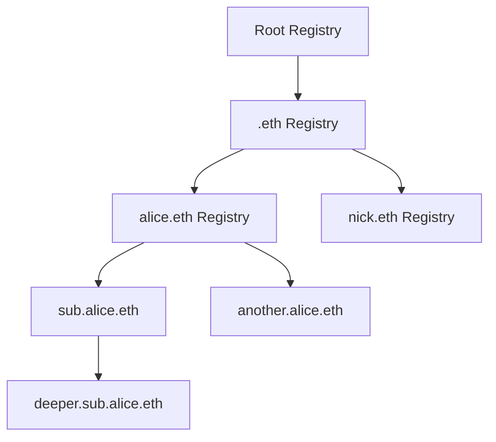

# ENSv2 for Hackers — ETHGlobal Workshop

> **Speaker:** Kevin — Technical Writer, DevRel @ ENS Labs
> **Format:** Slides only, no live coding · ~27 min (19 min talk + 8 min Q&A)
> **Focus:** What changed in ENSv2, and what you can build with it this hackathon

---

## ⚠️ Read this before you deploy

A **separate set of ENSv2 contracts was deployed to Sepolia specifically for this hackathon.** Build against these, not the main Sepolia deployment.

- The hackathon contracts are **frozen for the duration of the event**.
- The regular Sepolia deployment **may change** as fixes land ahead of mainnet.
- Find them via the banner at the top of [docs.ens.domains](https://docs.ens.domains) → links to a feature branch listing the deployments, plus the changes needed to point **viem** / **ensjs** at them.
- Kevin also posts the link in the hackathon Discord channel and the ENS developer Telegram group.

**Exception:** if you're entering the **Continuity track**, use the _regular_ Sepolia deployment instead — that track is about mainnet readiness.

---

## TL;DR

- ENS turns hex addresses into human-readable names — and has grown into a full **onchain profile** (avatars, socials, multi-chain addresses, arbitrary text/data records).
- **ENSv2 is a ground-up redesign**, not an upgrade. Ten years of lessons, applied.
- The single flat registry is gone. The name hierarchy is now **literally a tree of registries** in the contracts.
- You now deploy **your own resolver** by default (via a factory), and optionally **your own subregistry** and **registrar**.
- Permissions are handled by **Enhanced Access Control (EAC)** — role-based, and granular down to "can edit this one text record."
- **Token IDs are mutable.** Granting or revoking a role burns and re-mints the token. Plan for it.
- Two new **aliasing** features: share records between names, or alias an entire namespace.

---

## 1. Why ENS Exists

_(0:44 – 5:09)_

ENS is a **decentralized naming protocol on Ethereum**. It started by solving one problem: nobody can remember `0x52…`.

> Send 5 USDC to `0x5238…a91f`
> Send 5 USDC to `kevin.eth`

Think of ENS as a **user experience protocol for Ethereum**.

### It outgrew naming

A name today is an onchain profile. Kevin's own name carries:

| Record type | Examples                                                        |
| ----------- | --------------------------------------------------------------- |
| Socials     | X handle, GitHub handle                                         |
| Addresses   | Ethereum, Base, Bitcoin, Solana — one name, many chains         |
| Media       | Avatar                                                          |
| Arbitrary   | Text records and data records — build whatever you want on them |

### The canonical integration

Connect a wallet to a dapp and you get `0x71C7…976F`. Cold, unreadable, impersonal. Swap it for `kevin.eth` and the same UI becomes human.

Doing this requires **reverse resolution** — the app knows the address, not the name.

Live examples: **Snapshot**, **Matcha**, **Etherscan**. On a block explorer the difference is stark: a wall of hex versus "this user interacted with this contract."

> **The guiding principle:** users of crypto-powered experiences should never have to touch a hex address. Anywhere you read or write an address, you should be able to use an ENS name instead.

---

## 2. How Resolution Works

_(5:09 – 6:29)_

Two processes sit at the core of the ENS contracts:

| Process                | Direction          | Used when                              |
| ---------------------- | ------------------ | -------------------------------------- |
| **Forward resolution** | `nick.eth` → `0x…` | You have a name, you need an address   |
| **Reverse resolution** | `0x…` → `nick.eth` | An app knows only the connected wallet |

Forward resolution is multi-chain — the same name can point to different addresses on Ethereum, Base, Optimism, and so on. They're often the same key, but they don't have to be.

### Primary names

When both directions agree — the name points to an address **and** that address points back to the name — you have a verified loop. That's a **primary name**.

```
nick.eth ──── forward ────▶ 0xd8dA…6045
0xd8dA…6045 ── reverse ───▶ nick.eth
        = primary name ✓
```

---

## 3. What's New in ENSv2

_(6:29 – 13:14)_

### 3.1 Hierarchy is real now

**ENSv1** encoded the entire namespace in **one flat registry**, keyed by the `namehash` algorithm. At launch that was an elegant, gas-efficient answer to the constraints of the day.

**ENSv2** makes the tree structure explicit in the smart contracts:



Each level is its own registry contract. Nesting can go arbitrarily deep.

### 3.2 You deploy your own resolver

|                 | ENSv1                                     | ENSv2                                                                                     |
| --------------- | ----------------------------------------- | ----------------------------------------------------------------------------------------- |
| Default         | Shared **public resolver** for most names | **Your own resolver**                                                                     |
| Custom resolver | Possible, but opt-in and unusual          | The standard path                                                                         |
| Mechanism       | —                                         | Deploy a proxy against one shared implementation, via the **verifiable factory** contract |

Because it's a proxy against a shared implementation, deploying your own is cheap.

### 3.3 Subregistries and registrars

ENSv2 cleanly separates **registries** (who owns what) from **resolvers** (what the records say). Alongside your resolver you can deploy:

**A subregistry** — deployed through a factory as well. You want one if you plan to:

- issue subnames **as tokens**, or
- give subnames **differentiated permissions**.

You _don't_ need one if you only want to store records for subnames. In that case use **wildcard resolution**: keep the records in your resolver, skip tokenization entirely.

**A registrar** — one more contract on top, which defines _how_ people obtain a name in your subregistry. This is where you get creative:

- `5 USDC per year`
- must hold a particular NFT
- must complete some action
- anything you can express in Solidity

### A worked setup

For `nick.eth`, the full stack is three contracts:

```
nick.eth
├── Resolver      → what the records say
├── Subregistry   → who owns which subname (tokenized)
└── Registrar     → the rules for claiming one (e.g. 5 USDC/yr)
```

> 📖 There's a guide in the ENS docs walking through exactly this setup.

### 3.4 Enhanced Access Control (EAC)

A **role-based permission system** — roles plus admin roles — replacing the older, coarser model. Permissions include things like:

- set your own resolver
- create your own subregistry
- transfer the name
- **edit a single text record** (e.g. let someone update just the avatar)

This granularity is the big unlock. Some configurations worth exploring:

| Configuration                 | How                                                                                                                    |
| ----------------------------- | ---------------------------------------------------------------------------------------------------------------------- |
| **Non-transferable subnames** | Withhold the transfer role                                                                                             |
| **"Forever" subnames**        | Parent sets a very long expiry, then drops its own rights to interfere — subnames become _emancipated_ from the parent |
| **Delegated profile editing** | Grant only the "edit this text record" role                                                                            |

### 3.5 Mutable token IDs ⚠️

**Token IDs change when permissions change.** This is a direct consequence of EAC, and it's the thing most likely to bite you.

**Why:** imagine listing a name for sale advertising a certain set of permissions. Without this rule, the seller could strip those permissions after the buyer commits — a clean scam vector. So whenever a role is granted or revoked, the token is **burned and re-minted to the same owner**, with a new ID.

| Action                            | Token ID       |
| --------------------------------- | -------------- |
| Transfer the name                 | ✅ Unchanged   |
| Renew the name                    | ✅ Unchanged   |
| Grant or revoke a role            | ❌ **Changes** |
| Name expires and is re-registered | ❌ **Changes** |

> Don't cache token IDs as stable identifiers. Every edge case is documented in the ENSv2 docs.

### 3.6 Aliasing

Two distinct features share the name:

**Record-level aliasing** — point two names at the same set of records. Text records, address records, all of it. Change the address on one and it resolves identically for both. They are genuinely aliases, not copies.

**Registry-level aliasing** — point two names at the same subregistry. If `alice.eth` and `bob.eth` both alias one subregistry containing labels `a`, `b`, `c`, then `a.alice.eth` and `a.bob.eth` both exist and resolve, and so on down the list.

> You can alias an entire namespace. Worth exploring — there aren't many obvious precedents yet.

---

## 4. Why Be Excited About ENSv2

_(13:14 – 15:31)_

ENSv1 grew organically. Features were bolted on as people found new uses — the NameWrapper being the clearest example of accommodating demand that nobody anticipated at launch.

ENSv2 folds those ten years of lessons into a coherent redesign:

- **More flexible** — build structures ENSv1 couldn't express
- **Cleaner** — the design matches the mental model
- **More granular** — permissions down to individual records
- **New primitives** — aliasing, composable subregistries

---

## 5. What You Can Build

_(15:31 – 18:30)_

### AI agents as namespaces

A genuinely nice framing: treat an agent as a **namespace**, not an address.

```
kevin.eth
└── agent.kevin.eth        ← points to the current version
    ├── v1.agent.kevin.eth
    └── v2.agent.kevin.eth ← latest
```

The parent name points to whichever version is current. Text and data records on each name carry the agent's metadata.

Two relevant standards:

| Standard     | What it does                                                                                                                                                                                                                          |
| ------------ | ------------------------------------------------------------------------------------------------------------------------------------------------------------------------------------------------------------------------------------- |
| **ENSIP-25** | Two-way link between an ENS name and an **ERC-8004** agent registration. The agent's registration file claims the ENS name; the ENS name points back at the registry + agent ID, consenting to the claim. Both directions must agree. |
| **ENSIP-26** | Standardizes storing an **agent endpoint** (e.g. an agent-to-agent endpoint) in a text record.                                                                                                                                        |

> These are agreed conventions, not constraints. You're free to define your own record schema.

### Other directions

| Area                       | Idea                                                                           |
| -------------------------- | ------------------------------------------------------------------------------ |
| **Wallets**                | Integrate ENS by default — the UX gain is large and nearly free                |
| **Social apps**            | ENS names as usernames; records as a lightweight decentralized database        |
| **Usernames-as-a-service** | Issue subnames to your users                                                   |
| **Content**                | **Content hash** records + IPFS → a decentralized website behind your ENS name |

> The catch-all heuristic: **anywhere your UI shows a hex address, show an ENS name instead.**

---

## 6. Prizes

_(18:30 – 19:38)_

Two tracks.

### Track 1 — Best Use of ENSv2

The main focus. Build something creative on the new contracts.

| Place     | Prize  |
| --------- | ------ |
| 🥇 1st    | $1,500 |
| 🥈 2nd    | $1,500 |
| 🥉 3rd    | $1,000 |
| Runner-up | $500   |

### Track 2 — Continuity

| Prize          | $500                                                                                                                   |
| -------------- | ---------------------------------------------------------------------------------------------------------------------- |
| **Goal**       | Integrate ENSv2 into an app that **already exists**, in a sensible way — get it ready for the ENSv2 mainnet deployment |
| **Deployment** | Use the **regular Sepolia deployment**, not the frozen hackathon one                                                   |

---

## 7. Q&A

_(19:58 – 26:40)_

**Q: Can a subregistry or subname sit under another subregistry?**

Yes. Nested namespaces work as long as the parent subregistry has granted the necessary permissions. Depth is effectively unlimited.

---

**Q: Can ENS host a website frontend?**

Partly — and Kevin flagged this as outside his expertise. Content hash + IPFS is the well-trodden path. Storing a frontend **fully onchain** means solving compression; there has been prior work on this, but he wasn't up to date on the state of it.

> Called out as _"a very nice topic to explore during the hackathon."_

---

**Q (Javier): I'm building a game. Should each player get `javier.mygame.eth` under my namespace, or should players bring their own name and add my game to it?**

The most straightforward path is the first: own `mygame.eth`, issue a subname to every player.

Bonus: use **text and data records on those subnames to store game state** — items, stats, whatever the game needs. The subname becomes the player's profile.

---

**Q (Mauricio, Cochabamba 🇧🇴): We're building an interoperable loyalty and gamification engine — "gift tokens" for rewards, coupons, points, and miles, plus a shared loyalty currency. Brands, campaigns, and customers each hold wallets. Where does ENS fit?**

**Subnames**, first and foremost. Issue subnames to the protocol's users so you work with names rather than raw addresses — and every brand's customers get a personalized wallet identity.

**Follow-up — do you provide a paymaster for gas?**
No. That's a different layer of the stack and you'll need to solve it yourself. ENS is a resolution and discoverability layer — it translates addresses into names, nothing more.

---

**Q: Can Arc be used with ENS?**

Depends entirely on what you're doing with it. Resolution always reads from Ethereum mainnet, so you can _store_ whatever you like in records and fetch it from mainnet. Whether Arc specifically fits your case wasn't resolved — take it to Discord.

---

## 8. Links & Next Steps

| Resource                                 | Where                                                                |
| ---------------------------------------- | -------------------------------------------------------------------- |
| ENS docs (+ hackathon deployment banner) | [docs.ens.domains](https://docs.ens.domains)                         |
| ENS developer Telegram group             | Linked from the docs; QR code shown on the closing slide             |
| Hackathon support                        | ENS devs including Kevin are in the hackathon **Discord** throughout |
| Kevin                                    | Reachable on Telegram                                                |

**Checklist before you start building:**

- [ ] Grab the hackathon Sepolia deployment addresses from the docs banner
- [ ] Patch your viem / ensjs config to point at them
- [ ] Decide: resolver only (wildcard resolution), or resolver + subregistry + registrar?
- [ ] Sketch your EAC roles — what can subname holders do?
- [ ] Make sure nothing in your code assumes a token ID is permanent

---

## Transcription Notes

Cleaned up from an auto-generated transcript. Corrections applied to obvious speech-to-text errors — _Sapodia / Sapoleia / Solia_ → **Sepolia**, _ENF2 / NSB2 / ENSB2_ → **ENSv2**, _nameweber_ → **NameWrapper**, _white card_ → **wildcard**, _804_ → **ERC-8004**, _Ephoscan_ → **Etherscan**, and similar.

Two items to verify against the source material rather than trust here:

- The speaker's **surname** was garbled in the audio and is omitted.
- The agent standard was spoken ambiguously; read as **ENSIP-25** given that **ENSIP-26** is referenced immediately after, but confirm the number before citing it.
