# Section library

When each optional section earns its place, and worked examples of the ones that are hard to get right.

## Decision table

| Section | Include when | Skip when | Cost of getting it wrong |
|---|---|---|---|
| Table of contents | README exceeds ~300 lines | Anything shorter | Doubles perceived length, pushes the pitch off screen |
| Mermaid diagram | The critical path has 4+ actors | Two contracts and a call | A diagram nobody reads is dead weight |
| Directory tree | Monorepo with non-obvious layout | Standard Foundry project | Signals padding |
| API reference | Others will integrate during judging | Nobody will | Pure filler |
| Known issues | You found real limitations | You'd be listing unbuilt features | Listing unbuilt features reads as excuses |
| Formal verification | Specs actually run | Aspirational | Unverifiable claims invite scrutiny of everything else |
| Challenges I ran into | You have specific debugging stories | You'd be writing generalities | Generic "time was tight" wastes the section |
| Team table | Multiple contributors | Solo | Fine either way |
| Roadmap | 3–5 items with stated reasons | Wishlist | Checkbox wishlists advertise what's missing |
| Contributing | Post-hackathon repo will stay open | Submission is the endpoint | Harmless but empty |

## Mermaid sequence diagrams

One diagram covering the critical path. Group with `rect` blocks and label each phase, so a judge who reads nothing else understands the shape.

````markdown

```mermaid
sequenceDiagram
    actor Ada
    participant Escrow as RiyaEscrow (Ethereum)
    participant Relayer
    participant ASC as RiyaASC (Creditcoin)
    participant Ledger as LoanLedger

    rect rgb(40, 60, 40)
    Note over Ada,ASC: Deposit and prove
    Ada->>Escrow: deposit(1000 USDC)
    Escrow->>Escrow: supply to Aave
    Relayer->>ASC: submitProof(blockHeader, receipt)
    ASC->>ASC: verify via precompile 0x0FD2
    ASC-->>Ledger: credit collateral
    end

    rect rgb(30, 50, 60)
    Note over Escrow,Ledger: Yield retires debt
    Escrow->>Escrow: harvest() emits Harvested(25 USDC)
    Relayer->>ASC: submitProof(harvest receipt)
    ASC->>Ledger: reduceDebt(25 USDC)
    Ledger-->>Ada: debt 100 → 75
    end
```

````

Keep participant names matching real contract names. A diagram with invented component names is worse than none, because it implies the code doesn't match the documentation.

## Known issues

Structure each as: what breaks → why → what you did about it → why that tradeoff.

```markdown
### Dust withdrawals return zero

Calculating the withdrawal amount requires three values that can live on three
different chains, so it takes up to three cross-chain messages to resolve. When
the burn amount is small enough that the result rounds below 0.000001 USDC,
truncation returns zero, and transferring zero reverts downstream.

The current mitigation is to no-op rather than revert. Enforcing a minimum burn
would be cleaner, but the check can only run after the same three messages,
meaning the system would spend three cross-chain hops to tell someone their dust
is too small. The no-op keeps the system from a DoS path and the value accrues
to remaining holders.
```

This reads as engineering. "We didn't have time to fix rounding" does not.

## Challenges I ran into

Only include with specific stories that show diagnosis. The pattern: symptom → wrong hypothesis → what actually revealed it → fix.

```markdown
### Functions callback couldn't execute CCIP sends

The original rebalance design had the Chainlink Functions `fulfillRequest`
callback trigger the CCIP messages directly. It failed on testnet with an
unrelated revert in the Tenderly trace, which sent me looking in the wrong
place for hours. The real cause was the Functions callback gas ceiling.

The fix was a second automation layer: emit `StrategyUpdated` from the callback
and have log-trigger automation pick it up and send the CCIP messages. Custom
logic automation would also have worked but needed extra storage slots.
```

What makes this good: a wrong hypothesis is stated, the diagnostic tool is named, and an alternative design is weighed. Those three things are hard to fake and read as real engineering.

## Track alignment

Use the organiser's exact criterion wording. Point at code, don't assert.

```markdown
| Criterion | Where it's satisfied |
|---|---|
| Technical Alignment | Yield rate derived from two attested blocks via precompile `0x0FD2` — [`RiyaASC.sol#L112-L140`](https://github.com/user/repo/blob/a1b2c3d/src/RiyaASC.sol#L112-L140) |
| Proven Models | Self-repaying debt validated by Alchemix at scale; this is the first cross-chain implementation |
| User Base Expansion | Targets USDC holders needing CTC-side liquidity without selling or bridging |
```

## Things that consistently fail

- **Badge rows.** Build status, license, and version badges above the pitch push the one sentence that matters below the fold.
- **"This README is out of date."** Either update it or delete the warning. The warning invites the reader to distrust everything below it.
- **Hosting-provider runbooks.** Railway, Vercel, or AWS deployment steps belong in `docs/deploy.md`. No judge needs them and they add 40 lines.
- **Type dumps.** Pasting every TypeScript interface is padding unless someone will integrate against them during judging.
- **Unlabelled link dumps.** A column of explorer URLs with no indication of what each proves is evidence the reader can't use.
- **Future-tense features in present tense.** "Agents vote on optimal pool fees" when hooks are written but undeployed. Write "ready to deploy, currently using hookless pools" — the honest version costs nothing and a judge who checks will find the honest one credible.
